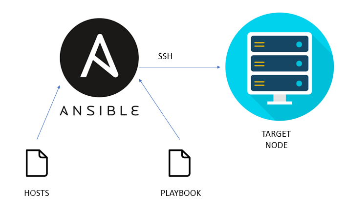

## Ansible

Ansible is a software tool that provides simple but powerful automation for cross-platform computer support.

## Advantages of Ansible
- Free: Ansible is an open-source tool.
- Very simple to set up and use: No special coding skills are necessary to use Ansible’s playbooks (more on playbooks later).
- Powerful: Ansible lets you model even highly complex IT workflows. 
- Flexible: You can orchestrate the entire application environment no matter where it’s deployed. You can also customize it based on your needs.
- Agentless: You don’t need to install any other software or firewall ports on the client systems you want to automate. You also don’t have to set up a separate management structure.
Efficient: Because you don’t need to install any extra software, there’s more room for application resources on your server.

## How Ansible works

- In Ansible, there are two categories of computers: the control node and managed nodes. The control node is a computer that runs Ansible
- Ansible works by connecting to nodes (clients, servers, or whatever you're configuring) on a network, and then sending a small program called an Ansible module to that node. Ansible executes these modules over SSH and removes them when finished.
- The only requirement for this interaction is that your Ansible control node has login access to the managed nodes

___

[Home](../README.md)

___

[Home](../README.md)